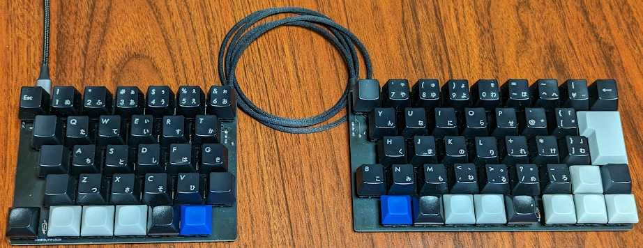
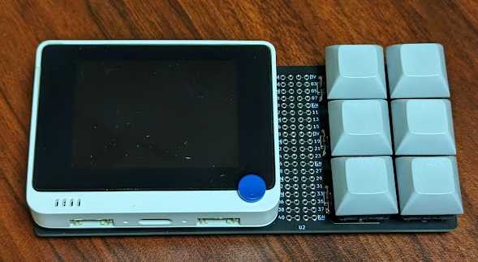
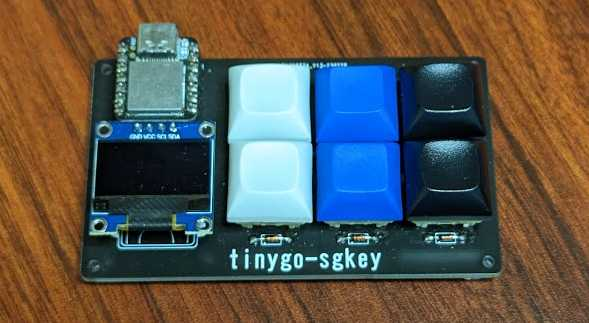
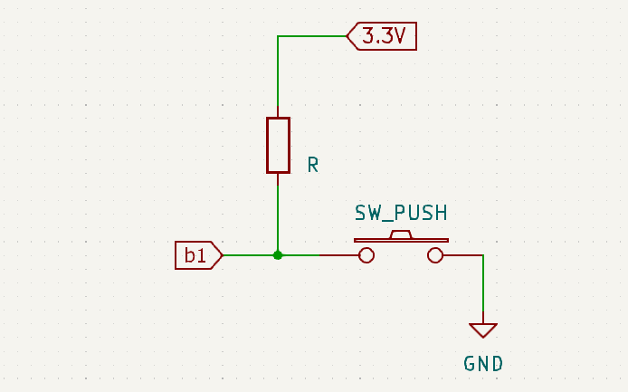
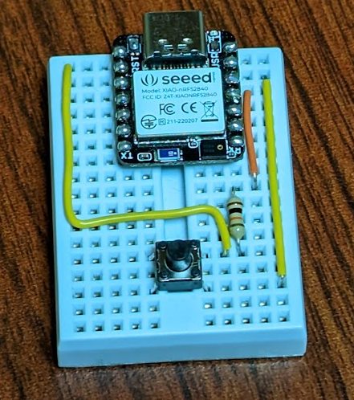
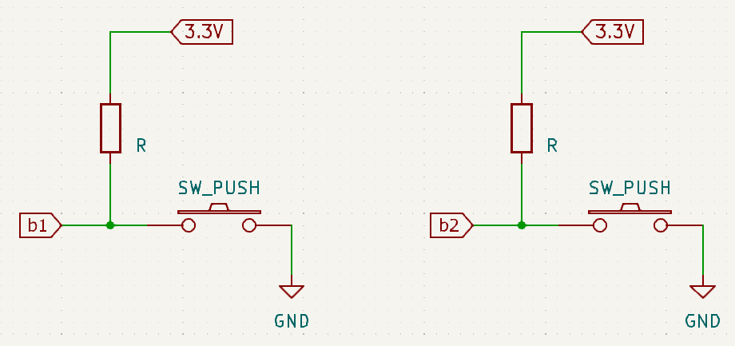
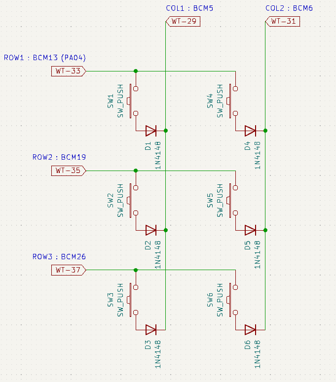
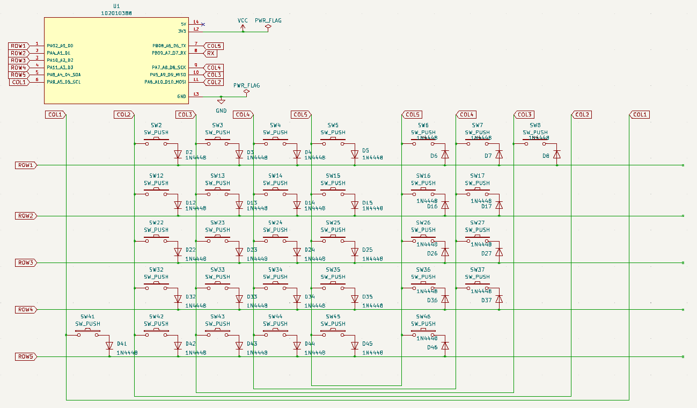

# お知らせ

TinyGo 0.26 + Wio Terminal という組み合わせで技術書「基礎から学ぶ TinyGoの組込み開発」 (2022/11/12 発売) を執筆しました。本ページと合わせて確認してみてください。

* https://sago35.hatenablog.com/entry/2022/11/04/230919

----



このページは 2023/06/02 に開催される Go Conference 2023 内の TinyGo で自作キーボードを作るハンズオン用の記事です。
不明点は、このリポジトリの Issue や [twitter:sago35tk](https://twitter.com/sago35tk) で質問いただければサポートします。
Twitter のハッシュタグは [#gocon](https://twitter.com/hashtag/gocon) および [#tinygo](https://twitter.com/hashtag/tinygo) です。

# 環境設定／参加に必要なもの

## TinyGo のインストール

以下のインストールが必要です。
TinyGo については、このページの記入時点の最新版である v0.27.0 の URL を記載しましたが、このハンズオンでは後述する dev branch 版 (開発最新版) を使うことを推奨します。

* Git
    * https://git-scm.com/downloads
* Go
    * https://go.dev/dl/
* TinyGo
    * https://github.com/tinygo-org/tinygo/releases/tag/v0.27.0

それぞれの実行体に PATH が通っていれば使うことができます。
少し Version が古いですが以下も参考になると思います。

* [TinyGo のインストール](https://qiita.com/sago35/items/92b22e8cbbf99d0cd3ef#tinygo-%E3%81%AE%E3%82%A4%E3%83%B3%E3%82%B9%E3%83%88%E3%83%BC%E3%83%AB)

### TinyGo の dev branch 版

GitHub Actions でビルドされた Artifact > release-double-zipped をダウンロードしてください。

* windows
  * https://github.com/tinygo-org/tinygo/actions/workflows/windows.yml?query=branch%3Adev
* linux
  * https://github.com/tinygo-org/tinygo/actions/workflows/linux.yml?query=branch%3Adev
* macos
  * https://github.com/tinygo-org/tinygo/actions/workflows/build-macos.yml?query=branch%3Adev


詳細は以下を参照してください。

* [TinyGo の開発版のビルド方法と、ビルドせずに開発版バイナリを手に入れる方法](https://qiita.com/sago35/items/33e63ca5073f572ad69c#pr-%E5%86%85%E3%81%A7%E4%BD%9C%E6%88%90%E3%81%95%E3%82%8C%E3%81%9F%E3%83%90%E3%82%A4%E3%83%8A%E3%83%AA%E3%82%92%E4%BD%BF%E3%81%86)

### LSP / gopls 対応

TinyGo は、 machine package などを GOROOT に配置しているため設定を行うまでは gopls 等でエラーが表示され machine.LED の定義元へのジャンプ等が出来ません。
TinyGo は machine package など (Go を良く知っていても) 慣れていない package 構成であったり、 build-tag による分岐などが多いため TinyGo 用の LSP の設定をしておいた方が無難です。

公式ドキュメントは以下にあります。

* https://tinygo.org/docs/guides/ide-integration/

VSCode の場合は TinyGo という拡張をインストールすると良いです。
Vim (+ vim-lsp) の場合は github.com/sago35/tinygo.vim を使ってみてください。

日本語の情報としては以下に記載しています。

* [TinyGo + 'VSCode or Vim (もしくはそれ以外の LSP 対応エディタ)' で gopls 連携する方法](https://qiita.com/sago35/items/c30cbce4a0a3e12d899c)
* [TinyGo + Vim で gopls するための設定](https://qiita.com/sago35/items/f0b058ed5c32b6446834)


## マイコンボード

参加にあたっては、各自でマイコンボードを準備お願いします。
推奨は以下です。

* Wio Terminal
  * https://akizukidenshi.com/catalog/g/gM-15275/
  * 本体にボタンがたくさんあるのでそのままでも楽しめますが、後述の wiokey があるとより楽しめます
* XIAO RP2040
  * https://akizukidenshi.com/catalog/g/gM-17044/
  * 本体にボタンが無いため、後述の sgkey か外付けボタン等があったほうが良い
* Raspberry Pi Pico
  * https://akizukidenshi.com/catalog/g/gM-16132/
  * 本体にボタンが無いため、外付けボタン等があったほうが良い
    * 現時点の TinyGo では BOOTSEL ボタンをボタンとして使用することは出来ません

一応、マイコンの種類が ATSAMD51 / ATSAMD21 / RP2040 / nRF52840 であれば問題ありません。
マイコンボード選びは以下の記事を確認いただくと良いですが、基本的には Wio Terminal がおすすめです。

* [TinyGo 0.27 で遊べるマイコンボード一覧](https://sago35.hatenablog.com/entry/2023/02/13/220248)

### wiokey : Wio Terminal 向けオプション



wiokey は Wio Terminal に 6 キー追加するためのボードです。
無くてもハンズオン可能ですが、wiokey があると自作キーボード気分が盛り上がると思います。

以下で基板単体、ハンダ付け済み完成品 (Wio Terminal は付属しません) を購入できます。

* https://sago35.booth.pm/


### sgkey : XIAO RP2040 向けオプション



sgkey は XIAO RP2040 などの XIAO 系ボードに 6 キーと液晶を追加するためのボードです。
無くてもハンズオン可能ですが、 sgkey があると自作キーボード気分が盛り上がると思います。

以下で基板単体、ハンダ付け済み完成品 (XIAO RP2040 は付属しません) を購入できます。

* https://sago35.booth.pm/


# TinyGo で自作キーボードを作る

基本的には上記推奨マイコンボードを例として記載します。
それ以外の環境を使う場合は、適宜質問するなどしてください。

## L チカ

以下を実行します。
以降では --target は wioterminal を例として記載します。

```
# Wio Terminal の場合
$ tinygo flash --target wioterminal --size short examples/blinky1

# XIAO RP2040 の場合
$ tinygo flash --target xiao-rp2040 --size short examples/blinky1

# Raspberry Pi Pico
$ tinygo flash --target pico --size short examples/blinky1
```

なお、 xiao-rp2040 と pico については、 tinygo flash 時にうまくいかない場合は BOOTSEL を押したまま USB 接続してブートローダーに入れてから tinygo flash してください。
一度書き込みに成功した後は tinygo flash が成功するようになります。

## L チカ (その2)

以下のソース (./01_blinky1) を適当な場所に作成してください。
led を 100ms 毎に反転させるソースコードとなります。

```go
package main

import (
	"machine"
	"time"
)

func main() {
	led := machine.LED
	led.Configure(machine.PinConfig{Mode: machine.PinOutput})
	for {
		led.Low()
		time.Sleep(time.Millisecond * 100)
		led.High()
		time.Sleep(time.Millisecond * 100)
	}
}
```

Go と同じく go mod init してから tinygo flash を実行することで書き込むことができます。

```
$ ls
main.go

$ go mod init blinky1

$ tinygo flash --target pico --size short .
```

うまく書き込めたら点滅周期を変えたり、 Wio Terminal の場合は `machine.LED` の代わりに `machine.LCD_BACKLIGHT` を使ってみてください。
外付けの LED を持っている場合は、それらをポート操作で光らせてみてもよいでしょう。

## USB CDCで Hello World

今回のハンズオンで使用するマイコンは TinyGo から USB 機能を使うことができます。
USB CDC は Universal Serial Bus Communications Device Class の略で、雑な説明としてはパソコンとマイコン間で通信を行うためのものです。
説明するよりも実際に試したほうが分かりやすいので、まずは以下を実行してみてください。
`--monitor` というオプションを追加する必要があります。

```
$ tinygo flash --target wioterminal --size short --monitor examples/serial
```

Windows で実行すると以下のようになります。

```
$ tinygo flash --target wioterminal --size short --monitor examples/serial
   code    data     bss |   flash     ram
   7092     108    6672 |    7200    6780
Connected to COM38. Press Ctrl-C to exit.
hello world!
hello world!
hello world!
(以下省略)
```

examples/serial は以下のようなソース (./02_usbcdc-serial) です。
`hello world!` を表示してから 1 秒待つ、を繰り返しています。
こちらも待ち時間や、表示文字列の変更、あるいは fmt.Printf() を使った書き込み、などに変えてみてください。

```
package main

import "time"

func main() {
	for {
		println("hello world!")
		time.Sleep(time.Second)
	}
}
```

標準入力は以下のようなソース (./03_usbcdc-echo) で扱うことができます。

```go
package main

import (
	"bufio"
	"fmt"
	"os"
)

func main() {
	scanner := bufio.NewScanner(os.Stdin)
	for scanner.Scan() {
		fmt.Printf("you typed : %s\n", scanner.Text())
	}
}
```

結果は以下のようになります。
bufio.Scanner は改行文字を読み込む必要があるので、行の区切りとして `<Ctrl-J>` を押す必要があります。

```
$ tinygo flash --target wioterminal --size short --monitor .
   code    data     bss |   flash     ram
  56652    1564    6676 |   58216    8240
Connected to COM38. Press Ctrl-C to exit.
(`hello` と入力した後、 <Ctrl-J> を押す)
you typed : hello
(`world` と入力した後、 <Ctrl-J> を押す)
you typed : there
```

## USB HID を使う

ここではマイコンボードを USB HID Keyboard (いわゆる USB 接続のキーボード) として扱うために machine/usb/hid/keyboard を用いた例を実行します。
以下のソース (./04_usbhid_keyboard) を書き込んでみてください。
接続後 5 秒経過した後、 `tinygo version` を実行します。
`keyboard.Port()` が存在しない、というエラーが出る場合は TinyGo の Version を上げるか、 `keyboard.New()` に変更してください。

```go
package main

import (
	"machine/usb/hid/keyboard"
	"time"
)

func main() {
	kb := keyboard.Port()

	time.Sleep(5 * time.Second)
	kb.Write([]byte("tinygo")) // 指定したキー列を入力
	time.Sleep(1 * time.Second)
	kb.Press(keyboard.KeySpace) // 単一キー入力
	kb.Press(keyboard.KeyV)
	kb.Press(keyboard.KeyE)
	kb.Press(keyboard.KeyR)
	kb.Press(keyboard.KeyS)
	kb.Press(keyboard.KeyI)
	kb.Press(keyboard.KeyO)
	kb.Press(keyboard.KeyN)
	kb.Down(keyboard.KeyEnter) // 押下
	kb.Up(keyboard.KeyEnter)   // 離す

	select {}
}
```

## Pin 入力を使った USB HID Keyboard

TinyGo では、 Pin 入力を使ってボタン等の状態を取得します。
ここでは Pin 入力を用いてキーボードとして動作させます。
以下のソース (./05_usbhid_keyboard2) を使うと、 `b1` で指定するボタンを押している時だけ `t` キーを押した状態となります。
これは最もシンプルな USB HID Keyboard の例になります。

```go
package main

import (
	"machine"
	"machine/usb/hid/keyboard"
	"time"
)

func main() {
	// ボタンの定義はマイコン毎に変更する必要あり
	b1 := machine.BUTTON // wioterminal の場合
	//b1 := machine.D0 // xiao-rp2040 の場合
	// b1 := machine.GP0 // pico の場合

	b1.Configure(machine.PinConfig{Mode: machine.PinInputPullup})

	kb := keyboard.Port()
	for {
		if b1.Get() {
			kb.Up(keyboard.KeyT)
		} else {
			kb.Down(keyboard.KeyT)
		}

		time.Sleep(time.Millisecond * 10)
	}
}
```

それぞれのマイコンのボタン／ピン位置は以下になります。
ボタンはそのまま押せばよいですが、ピンについてはスイッチを経由して GND に接続してください。
スイッチが無い場合は、ジャンプワイヤや針金等により該当ピンと GND を接続してください。

* wioterminal : BUTTON
  * 上面の一番右側 (中央側) のボタン
* xiao-rp2040 : D0
  * 左上のピン : https://wiki.seeedstudio.com/XIAO-RP2040/#hardware-overview
* pico : GP0
  * 左上のピン : https://www.raspberrypi.com/documentation/microcontrollers/raspberry-pi-pico.html#pinout-and-design-files

このサンプルは以下の回路を想定しています。
Pullup 抵抗 (R) は 1 ～ 10K ぐらいで設定すると良いですが、上記コードでは `machine.PinInputPullup` を使っていて内部プルアップが有効となっているため抵抗を省略しても問題ありません。



ブレッドボードでの接続例は以下です。



## Pin 入力を使った USB HID Keyboard (入力を増やす)

続いて、入力を増やしてみましょう。
ここでは、 `Shift` キーと `t` キーを作ってみます。
以下のソース (./06_usbhid_keyboard3) を使うと、 `t` と `T` を入力できるキーボードを作成することができます。
前述のソースとの違いは、 b2 のコードの追加、となります。

```go
package main

import (
	"machine"
	"machine/usb/hid/keyboard"
	"time"
)

func main() {
	// ボタンの定義はマイコン毎に変更する必要あり
	b1 := machine.BUTTON_1 // wioterminal の場合
	b2 := machine.BUTTON_2 // wioterminal の場合
	//b1 := machine.D0 // xiao-rp2040 の場合
	//b2 := machine.D1 // xiao-rp2040 の場合
	// b1 := machine.GP0 // pico の場合
	// b2 := machine.GP1 // pico の場合

	b1.Configure(machine.PinConfig{Mode: machine.PinInputPullup})
	b2.Configure(machine.PinConfig{Mode: machine.PinInputPullup})

	kb := keyboard.Port()
	for {
		if b1.Get() {
			kb.Up(keyboard.KeyT)
		} else {
			kb.Down(keyboard.KeyT)
		}
		if b2.Get() {
			kb.Up(keyboard.KeyLeftShift)
		} else {
			kb.Down(keyboard.KeyLeftShift)
		}

		time.Sleep(time.Millisecond * 10)
	}
}
```

このサンプルは以下の回路を想定しています。



## sago35/tinygo-keyboard を使う

先ほどのコードのようなものを sago35/tinygo-keyboard を使って書いてみます。
AddGpioKeyboard を使うことで同じ機能を実現できます。

sago35/tinygo-keyboard を使うには `go get` が必要です。

```
$ go get -v github.com/sago35/tinygo-keyboard
```

以下のコード (./07_gpiokeyboard) は、 Wio Terminal 用です。
gpioPins で指定されるそれぞれのボタンが、 `d.AddGpioKeyboard` 時の keyboard.Keycode で指定されるキーとなります。
gpioPins で指定されるそれぞれのボタンは、すべて Pullup されていて、押下で Low、離すと High になります。


```go
package main

import (
	"context"
	"machine"

	keyboard "github.com/sago35/tinygo-keyboard"
	"github.com/sago35/tinygo-keyboard/keycodes/jp"
)

func main() {
	d := keyboard.New()

	gpioPins := []machine.Pin{
		machine.WIO_KEY_A,
		machine.WIO_KEY_B,
		machine.WIO_KEY_C,
		machine.WIO_5S_UP,
		machine.WIO_5S_LEFT,
		machine.WIO_5S_RIGHT,
		machine.WIO_5S_DOWN,
		machine.WIO_5S_PRESS,
	}

	for c := range gpioPins {
		gpioPins[c].Configure(machine.PinConfig{Mode: machine.PinInput})
	}

	// KeyMediaXXX will be supported starting with tinygo-0.28.
	d.AddGpioKeyboard(gpioPins, [][][]keyboard.Keycode{
		{
			{
				jp.KeyA,
				jp.KeyB,
				jp.KeyC,
				jp.KeyMediaVolumeInc,
				jp.KeyLeft,
				jp.KeyRight,
				jp.KeyMediaVolumeDec,
				jp.KeyEnter,
			},
		},
	})

	d.Loop(context.Background())
}
```

## sago35/tinygo-keyboard のレイヤーキーを使う

自作キーボードのファームウェアにはレイヤーと呼ばれる考え方があります。
例えば特定のキーを押している時だけキー設定を切り替える事が出来ます。
以下のソース (./08_gpiokeyboard_with_layer) では、 `jp.KeyMod1` を押していない時は `layer 0`、押しているときは `layer 1` のキーマップが有効となります。

```go
package main

import (
	"context"
	"machine"

	keyboard "github.com/sago35/tinygo-keyboard"
	"github.com/sago35/tinygo-keyboard/keycodes/jp"
)

func main() {
	d := keyboard.New()

	gpioPins := []machine.Pin{
		machine.WIO_KEY_A,
		machine.WIO_KEY_B,
		machine.WIO_KEY_C,
		machine.WIO_5S_UP,
		machine.WIO_5S_LEFT,
		machine.WIO_5S_RIGHT,
		machine.WIO_5S_DOWN,
		machine.WIO_5S_PRESS,
	}

	for c := range gpioPins {
		gpioPins[c].Configure(machine.PinConfig{Mode: machine.PinInput})
	}

	// KeyMediaXXX will be supported starting with tinygo-0.28.
	d.AddGpioKeyboard(gpioPins, [][][]keyboard.Keycode{
		{
			// layer 0
			{
				jp.KeyA,
				jp.KeyB,
				jp.KeyMod1,
				jp.KeyUp,
				jp.KeyLeft,
				jp.KeyRight,
				jp.KeyDown,
				jp.KeyEnter,
			},
		},

		{
			// layer 1
			{
				jp.KeyX,
				jp.KeyY,
				jp.KeyMod1,
				jp.KeyMediaVolumeInc,
				jp.KeyLeft,
				jp.KeyRight,
				jp.KeyMediaVolumeDec,
				jp.KeyEnter,
			},
		},
	})

	d.Loop(context.Background())
}
```

## matrix keyboard を扱う

wiokey および sgkey はマトリクス配線によりキースイッチを接続しています。
詳細な説明は以下にあります。

* [キーボードのマトリクス方式の分類 > マトリクス](https://blog.ikejima.org/make/keyboard/2019/12/14/keyboard-circuit.html)
  * wiokey : マトリクス+ダイオード逆向き(ROW2COL)
  * sgkey : マトリクス+ダイオード(COL2ROW)

ここでは wiokey を題材として、単純な例を紹介します。
手順としては以下の通りです。

* SW1 / SW2 の読み込み
  * r1 を H に、 r2 と r3 を L にして、 c1 を読み込むと SW1、 c2 を読み込むと SW2 の状態が取得できます
* SW3 / SW4 の読み込み
  * r2 を H に、 r1 と r3 を L にして、 c1 を読み込むと SW3、 c2 を読み込むと SW4 の状態が取得できます
* SW5 / SW6 の読み込み
  * r3 を H に、 r1 と r2 を L にして、 c1 を読み込むと SW5、 c2 を読み込むと SW6 の状態が取得できます

sgkey の場合は以下の通りです。

* SW1 / SW2 / SW3 の読み込み
  * r1 を H に、 r2 を L にして、 c1 を読み込むと SW1、 c2 を読み込むと SW2、 c3 を読み込むと SW3 の状態が取得できます
* SW4 / SW5 / SW6 の読み込み
  * r2 を H に、 r1 を L にして、 c1 を読み込むと SW4、 c2 を読み込むと SW5、 c3 を読み込むと SW6 の状態が取得できます

実際のソースコード例を以下 (./09_matrix_wiokey) に作成しました。
出力ピンの電位を切り替えた後は、電位が落ち着くまで少し待つ必要があることに注意が必要です。
sgkey 版のソースは後述します。


```go
package main

import (
	"machine"
	"machine/usb/hid/keyboard"
	"time"
)

var (
	c1 = machine.BCM5
	c2 = machine.BCM6
	r1 = machine.BCM13 // machine.PA04
	r2 = machine.BCM19
	r3 = machine.BCM26
)

func main() {
	kb := keyboard.Port()

	c1.Configure(machine.PinConfig{Mode: machine.PinInputPulldown})
	c2.Configure(machine.PinConfig{Mode: machine.PinInputPulldown})
	r1.Configure(machine.PinConfig{Mode: machine.PinOutput})
	r2.Configure(machine.PinConfig{Mode: machine.PinOutput})
	r3.Configure(machine.PinConfig{Mode: machine.PinOutput})
	for {
		// SW1 / SW2 を読み込むため、 r1 を H、 r2 と r3 を L に
		r1.High()
		r2.Low()
		r3.Low()
		time.Sleep(1 * time.Millisecond) // 少し待つ

		// SW1
		if c1.Get() {
			kb.Down(keyboard.KeyA)
		} else {
			kb.Up(keyboard.KeyA)
		}

		// SW2
		if c2.Get() {
			kb.Down(keyboard.KeyB)
		} else {
			kb.Up(keyboard.KeyB)
		}

		// SW3 / SW4 を読み込むため、 r2 を H、 r1 と r3 を L に
		r1.Low()
		r2.High()
		r3.Low()
		time.Sleep(1 * time.Millisecond) // 少し待つ

		// SW3
		if c1.Get() {
			kb.Down(keyboard.KeyC)
		} else {
			kb.Up(keyboard.KeyC)
		}

		// SW4
		if c2.Get() {
			kb.Down(keyboard.KeyD)
		} else {
			kb.Up(keyboard.KeyD)
		}

		// SW5 / SW6 を読み込むため、 r3 を H、 r1 と r2 を L に
		r1.Low()
		r2.Low()
		r3.High()
		time.Sleep(1 * time.Millisecond) // 少し待つ

		// SW5
		if c1.Get() {
			kb.Down(keyboard.KeyE)
		} else {
			kb.Up(keyboard.KeyE)
		}

		// SW6
		if c2.Get() {
			kb.Down(keyboard.KeyF)
		} else {
			kb.Up(keyboard.KeyF)
		}

		time.Sleep(16 * time.Millisecond)
	}
}
```

このサンプルは以下の回路を想定しています。




sgkey 版のソースは以下になります。

* [./09_matrix_sgkey/main.go](./09_matrix_sgkey/main.go) になります。

## matrix keyboard を sago35/tinygo-keyboard から扱う

先ほどの例は以下のソース (./10_matrixkeyboard_wiokey) になります。
matrix keyboard ぐらいになると、 sago35/tinygo-keyboard を使ったほうが簡単に書けます。

```go
package main

import (
	"context"
	"machine"

	keyboard "github.com/sago35/tinygo-keyboard"
	"github.com/sago35/tinygo-keyboard/keycodes/jp"
)

func main() {
	d := keyboard.New()

	colPins := []machine.Pin{
		machine.BCM5,
		machine.BCM6,
	}

	rowPins := []machine.Pin{
		machine.BCM13, // machine.PA04
		machine.BCM19,
		machine.BCM26,
	}

	d.AddMatrixKeyboard(colPins, rowPins, [][][]keyboard.Keycode{
		{
			{jp.KeyT, jp.KeyI},
			{jp.KeyN, jp.KeyY},
			{jp.KeyG, jp.KeyO},
		},
	}, keyboard.InvertDiode(true))

	d.Loop(context.Background())
}
```

`d.AddMatrixKeyboard()` の引数の `keyboard.InvertDiode(true)` はダイオードの向きによって設定変更が必要です。
wiokey は `マトリクス+ダイオード逆向き(ROW2COL)` のため true にする必要があります。
sgkey は `マトリクス+ダイオード(COL2ROW)` のため false (default は false) にする必要があります。


## duplex matrix keyboard を扱う

以下にコード例があるので参考にしてください。

* [github.com/sago35/tinygo-keyboard/targets/sgkb/left/main.go](https://github.com/sago35/tinygo-keyboard/blob/main/targets/sgkb/left/main.go)

想定する回路は以下の通りです。


